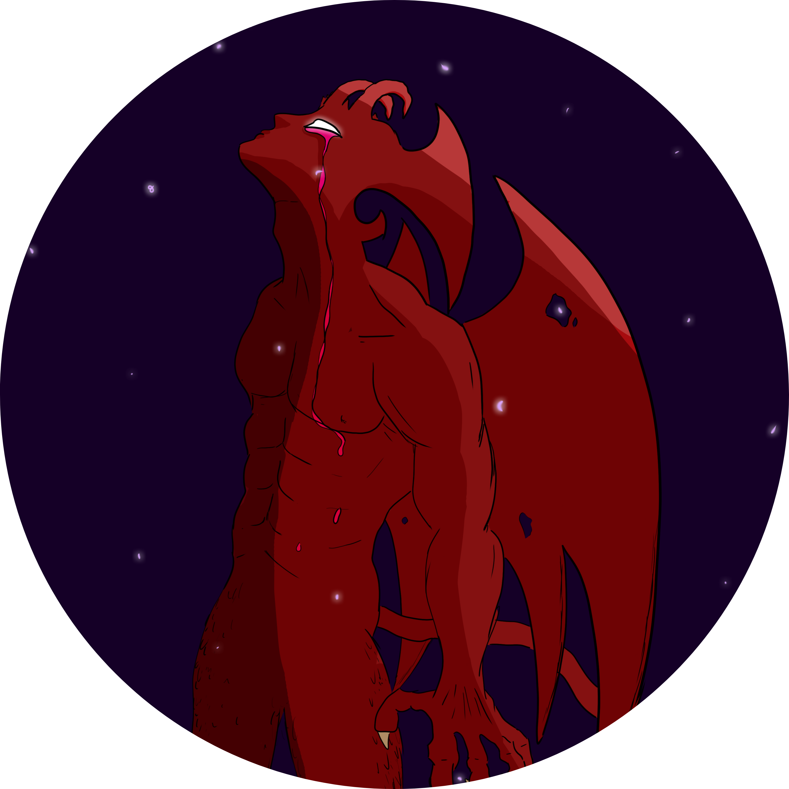

	  

Hi ! I'm `vhs`, a french offensive security consultant. I am particularly interested in red teaming, malware development and defense evasion. This blog serves primarily as a personal reference guide for my different works.

## Work

Continuously learning and working on a custom command and control (C2) framework on my free time.

## Contact

Feel free to reach me out and stalk me on [LinkedIn](https://www.linkedin.com/in/clement-rault/) or to send me an email at Y2xlbWVudC5yYXVsdEBwcm90b24ubWU= (base64).

## Links

- GitHub: [https://github.com/0x766873](https://github.com/0x766873)
